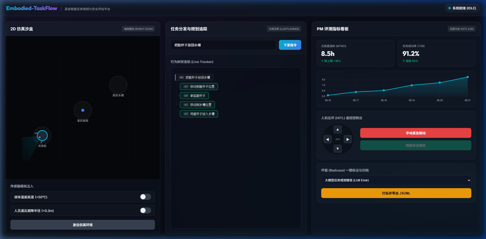
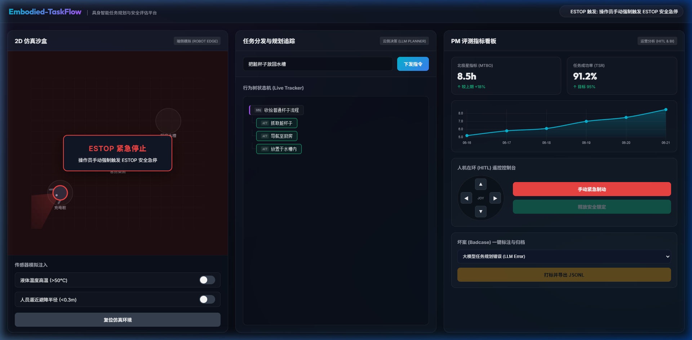

# Embodied-TaskFlow-PM

> **具身智能任务规划与多模态安全评估系统**  
> An Enterprise-Grade Task Planning & Multi-Modal Safety Evaluation Platform for Mobile Manipulator and Humanoid Robots.

---

## 产品经理设计日志 (PM Design Log)

作为具身智能产品经理，本项目立项的核心目的在于解决机器人从“大模型逻辑推理”到“物理世界实体操作”过程中的安全性、泛化性与评测闭环问题。

### 核心痛点与立项背景
在智能家庭和仓储分拣等非结构化环境中，大语言模型（LLM）常因缺乏物理世界的常识与触达边界（Affordance）认知，产生逻辑上可行但物理上危险的决策。例如：试图单手搬运超过负载的重物，或在积水地面上高速移动。

本项目提供了一套完整的任务分发、行为树转化、本地策略安全拦截（ESTOP）以及人工接管（HITL）的数据回收闭环，为机器人提供一套兼顾高层推理与端侧安全反射的产品架构。

### 商业化与系统架构设计折中 (Design Trade-offs)
- **选择端云协同而非全端侧计算**：将强算力的视觉语言模型（VLM）与复杂的长序列规划器（LLM）部署于云端，以降低机器人单机的芯片 BOM 成本，使得低成本（15万以内）量产家庭服务机器人成为可能；端侧本地则部署轻量化安全策略拦截引擎，保证 20ms 以内的紧急制动反射时延，保障人机共存环境的物理安全。
- **定位双臂人形机器人而非工业臂**：人形形态在非结构化家庭环境中拥有最强的场景泛化能力（如跨越台阶、触及不同高度的台面），虽然控制算法复杂，但能够最大化验证高层语义规划的灵活性，符合中长期商业化价值。

### 行业安全与合规标准 (Compliance)
本系统的安全架构设计与拦截规则，严格遵循以下国际安全规范：
- **ISO 13482**：个人护理/家庭服务机器人安全标准。
- **ISO 10218**：工业及人机协作机器人安全标准。

---

## 北极星核心评测指标 (North Star Metrics)

系统通过以下四项核心定量指标，评估机器人高层规划与安全系统性能：

1. **任务成功率 (Task Success Rate, TSR)**：
   $$\text{TSR} = \frac{\text{成功完成的指令数}}{\text{总下发指令数}} \times 100\%$$
   - 评估高层语义拆解及行为树转换的准确度。
2. **平均人工干预间隔时间 (Mean Time Between Overrides, MTBO)**：
   - 评估系统泛化性。MTBO 越长，代表机器人的自主运行（Autonomous）能力越强，运营成本越低。
3. **路径执行效率比 (Path Efficiency Ratio, PER)**：
   $$\text{PER} = \frac{\text{理论最短路径长度}}{\text{机器人实际行走路径长度}}$$
   - 用于评估高层规划是否绕路、动作是否冗余，直接关系到单次充电的续航时间。
4. **安全策略误拦截率 (False Positive Rate of Safety Rules)**：
   - 评估安全引擎因误判而导致任务中断的比例。PM 需在“极端安全”与“运行效率”之间寻找最优平衡点。

---

## 目录结构 (Directory Structure)

项目遵循标准的工业级开源软件与文档规范：

```txt
embodied-taskflow/
├── README.md               # 项目主说明文档 (含 PM 核心设计理念)
├── docs/                   # 产品、架构与技术设计文档
│   ├── prd/                # 产品需求文档 (Product Requirements Documents)
│   │   └── PRD-001-embodied-task-planning.md  # 任务规划与安全策略核心 PRD
│   ├── system_design/      # 系统架构与 API 接口说明
│   │   ├── SYS-001-architecture-spec.md       # 系统分层与通信协议设计
│   │   └── SYS-002-safety-rules-and-data-flywheel.md  # 安全规则与数据飞轮标注规范
│   └── evaluation/         # 评测标准与 Benchmark 数据集说明 (含评测指标与坏案回流数据)
│       ├── VAL-001-metrics-dashboard.md   # 产品指标与评测看板设计规范
│       └── PROJECT_RETROSPECTIVE.md        # 项目整体回顾与产品审计报告 (PM 审计)
├── src/                    # 源代码目录 (含 Web 2D 仿真沙盒与高层规划引擎后端)
└── tests/                  # 单元测试与集成评测用例
```

---

## 开发路线图 (Roadmap)

- **Phase 1: 产品定义与系统建模 (已完成)**
  - [x] 初始化项目目录与基础框架文档
  - [x] 完成任务规划系统核心 PRD 撰写 (`PRD-001`)
  - [x] 完成端云协同系统架构及 API 规范设计 (`SYS-001`)
  - [x] 完成安全规则库与数据飞轮 JSONL 标注协议设计 (`SYS-002`)
- **Phase 2: 核心规划引擎与安全策略实现 (已完成)**
  - [x] 开发基于大模型 API 的任务拆解模块（LLM Planner）
  - [x] 编写基于规则与置信度的物理安全拦截器（Safety Interceptor）
- **Phase 3: 仿真模拟与 PM 看板构建 (已完成)**
  - [x] 实现 Web 2D 可视化仿真沙盒，模拟环境物理变化
  - [x] 搭建 PM 评测数据仪表盘，支持 Session 坏案标记与人工干预（HITL）

---

## 项目运行演示 (Demonstrations)

### 1. 任务规划与全自动沙盒仿真闭环
通过大模型将用户的模糊指令（“把脏杯子放回水槽”）解析为任务行为树，驱动 2D 沙盒中机器人的物理运动（导航 -> 抓取 -> 导航 -> 放置）。


### 2. 评测大屏监控与异常红灯锁定 (ESTOP)
监控任务能耗估算与视觉置信度，并且当大模型输出具有危险边界的动作时，系统会自动拦截触发安全锁定。


### 3. 人工干预接管 (Teleop) 与坏案打标 (Badcase Export)
支持运营或 PM 手动通过方向键对机器人进行遥控干预，并将失败的 Session 或不合理的规划树一键导出为 JSONL 数据集，用于后续大模型微调 (SFT) 数据飞轮。


---

## 快速开始 (Quick Start)

### 1. 阅读产品文档
请先阅读 [PRD-001-embodied-task-planning.md](file:///D:/embodied-taskflow/docs/prd/PRD-001-embodied-task-planning.md) 了解系统核心需求及安全机制设计。

### 2. 阅读架构与接口协议
请阅读 [SYS-001-architecture-spec.md](file:///D:/embodied-taskflow/docs/system_design/SYS-001-architecture-spec.md) 了解系统分层与数据协议。  
请阅读 [SYS-002-safety-rules-and-data-flywheel.md](file:///D:/embodied-taskflow/docs/system_design/SYS-002-safety-rules-and-data-flywheel.md) 了解安全规则及数据飞轮的标注设计。

### 3. 阅读项目回顾与审计报告
请阅读 [PROJECT_RETROSPECTIVE.md](file:///D:/embodied-taskflow/docs/evaluation/PROJECT_RETROSPECTIVE.md) 了解项目的交付情况、PM 深度分析与未来动作项。
