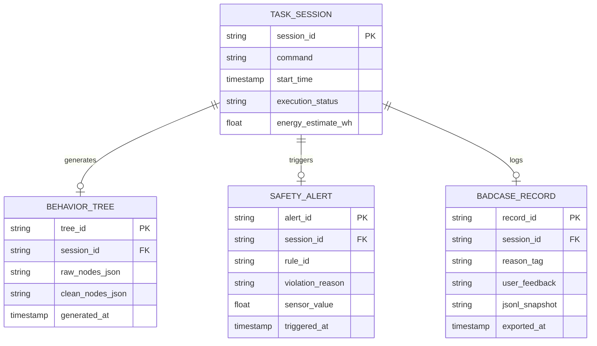
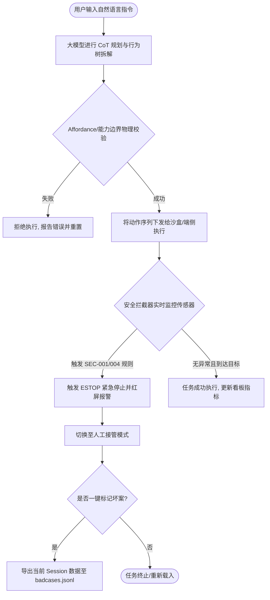
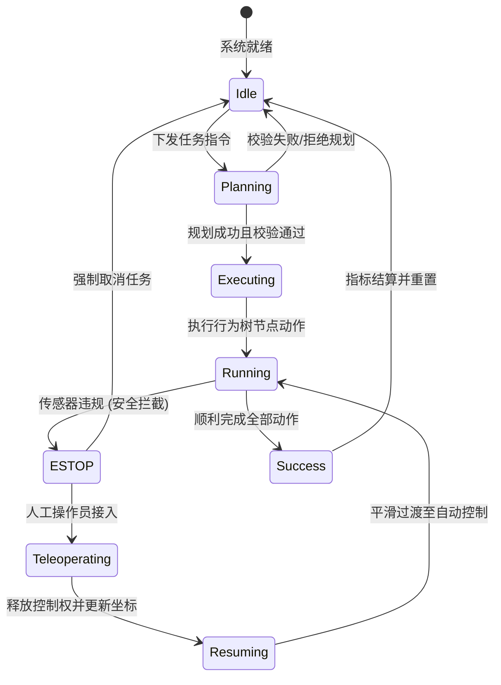

# 具身智能任务规划与安全评估平台 PRD

| PRD 审核人 | 具身智能评审委员会 |
| --- | --- |
| 重要性 | 高 |
| 紧迫性 | 高 |
| 需求方 | 具身智能算法集成商、端侧控制研发组、现场运营与数据分析组 |
| PRD 编写人 | 具身智能产品经理 (Embodied AI PM) |
| PRD 提交日期 | 2026-06-22 |

## PRD 修改记录

| 变更时间 | 变更内容 | 变更提出部门与理由 | 修改人 | 审核人 | 版本号 |
| --- | --- | --- | --- | --- | --- |
| 2026-06-21 | 初始草案版本 | 初始立项，定义基础框架与核心功能 | Embodied AI PM | 评审委员会 | v1.0.0 |
| 2026-06-22 | 依照新版 PRD 规范重构，补全 14 章节与 Mermaid 架构/数据/状态图表 | 按照系统新技能规范进行标准化与内容升级 | Embodied AI PM | 评审委员会 | v1.1.0 |

---

## 1、项目背景

### 1.1 行业痛点
当前，基于大语言模型 (LLM) 和多模态大模型 (VLM) 的具身智能技术正在经历从实验室走向商用的关键阶段。然而，在真实物理世界（特别是家庭和仓储等非结构化环境）中落地时，面临以下痛点：
1. **语义鸿沟 (Semantic Gap)**：人类指令（如“收拾一下房间”）是高度模糊的，而机器人底层控制（运动规划、力控）需要精确的轨迹点和离散的动作序列 (Action Tokens)。
2. **长尾与物理安全风险 (Safety & Long-Tail)**：纯端到端大模型容易产生“物理幻觉”（例如：将猫当成抹布、试图搬运超过自身负载的重物），导致设备损坏或人身伤害。
3. **数据黑盒与难以评估 (Black-box Evaluation)**：大模型做出的规划链路难以被监控和审计，缺乏有效的坏案 (Bad Cases) 人工接管及数据回流迭代（数据飞轮）闭环。

### 1.2 产品定位与愿景
本平台是一款面向**双臂移动人形机器人 (Humanoid Robot)** 的**高层任务规划与安全评估平台**。通过构建“感知-规划-安全拦截-仿真反馈-数据回流”的产品闭环，降低机器人任务失败率，实现物理安全可控，并为后续大模型微调提供高质量的数据飞轮。

---

## 2、需求基本情况

### 2.1 需求概述
本系统主要提供：
- 模糊指令的云端大模型任务树规划与高容错动作拆解。
- 本地 20ms 级紧急安全拦截策略 (ESTOP) 引擎，包含活体检测、碰撞过载与液体高温校验。
- Web 可视化 2D 仿真物理沙盒，展现规划执行状态与实体反馈。
- 云端人工在环 (HITL) 遥控接管与一键坏案打标导出 JSONL 格式功能。

### 2.2 目标受众与角色分析
1. **系统集成商/算法开发人员 (System Integrator)**：需要定制和评测机器人高层规划与安全规则，并获取真实的坏案数据集以微调模型。
2. **现场运营/值班操作员 (Teleoperator)**：在机器人触发安全报警、物理锁定或规划失败时，需要进行实时可视化监控与方向键/手柄遥控纠偏。

---

## 3、商业分析

### 3.1 架构折中设计与商业化路径
- **端云协同架构**：将高算力需求的多模态规划器部署于云端，以降低机器人单机芯片的 BOM 成本（将目标控制在 15 万人民币以内），从而使家庭服务机器人的规模化量产成为可能；本地端侧则部署超轻量化的安全策略拦截器，保障 20ms 以内的紧急反射制动。
- **物理构型选择**：定位为双臂轮式/双足人形形态，而非固定的工业机械臂，以最大化满足非结构化家庭环境中跨越台阶、触及不同高度台面的场景泛化需求。

### 3.2 竞争优势与差异化
- **安全反射机制 (ESTOP)**：相比于其他仅依赖云端大模型生成安全动作的系统，本平台提供了独立的本地硬规则安全拦截层，确保云端断网或大模型幻觉时机器人的绝对安全。
- **闭环数据飞轮 (Data Flywheel)**：提供低门槛的一键坏案打标，打标数据直接归档为 JSONL 并可用于 SFT（监督微调），加速大模型的场景适配。

---

## 4、项目收益目标

通过以下四项核心定量指标，评估并提升高层规划与安全拦截系统的商业与技术效益：

1. **任务成功率 (Task Success Rate, TSR) 目标值：>= 95.0%**
   - 计算公式：(成功完成的指令数 / 总下发指令数) * 100%。评估高层拆解的有效性。
2. **平均人工干预间隔时间 (Mean Time Between Overrides, MTBO) 目标值：>= 12.0 小时**
   - 机器人自主运行无需人类接管的平均时长，直接决定了运营人机配比的经济模型。
3. **路径执行效率比 (Path Efficiency Ratio, PER) 目标值：>= 0.85**
   - 计算公式：理论最短路径长度 / 实际行走路径长度。限制冗余动作以延长续航。
4. **安全策略误拦截率 (Safety False Positive Rate) 目标值：<= 2.0%**
   - 保证系统安全的同时，避免频繁误拦截导致工作效率低下。

---

## 5、项目方案概述

### 5.1 系统核心模块
- **大模型规划引擎 (LLM Planner)**：运行于云端，接收自然语言，生成符合 Skill 技能库规范的 JSON 行为树动作序列。
- **本地安全拦截器 (Safety Interceptor)**：运行于端侧，监控传感器输入（距离、力矩、温度），执行优先级高于大模型规划的 ESTOP 反射。
- **物理沙盒仿真器 (Simulator Sandbox)**：高保真 2D Canvas 网页仿真，支持物品抓取、放置、位置更新及传感器状态变化。
- **PM 数据评估大屏幕 (PM Dashboard)**：集中展示 MTBO、TSR，集成遥控面板 (Teleop) 及坏案导出接口。

---

## 6、项目范围

### 6.1 功能范围 (In Scope)
- 自然语言（“把脏杯子放回水槽”、“把水杯拿到桌子上”）的解析与执行。
- 液体高温（温度 > 50°C）、人影靠近（距离 < 0.5m）的动态实时检测与红屏安全锁定。
- 云端摇杆/方向键人工遥控及机器人坐标的增量平滑移动。
- Session 会话坏案分类标注（大模型幻觉、安全误拦、碰撞异常）与本地 JSONL 日志文件的追加写入。

### 6.2 边界与排除范围 (Out of Scope)
- 机械爪具体的指尖力控抓取力反馈细节逻辑（仿真器仅做信号级 Mock）。
- 跨楼层、跨区域的复杂多传感器 SLAM 地图构建（当前仿真地图为预设的拓扑区域图）。

---

## 7、项目风险

### 7.1 核心风险评估
- **网络时延风险 (Latency)**：大模型云端生成规划树耗时取决于网络，当网络差时可能超出 2.0s 限制。
  - *缓解措施*：端侧保留基础行为树，并引入本地兜底规划器，在弱网或网络断开时平稳降级。
- **传感器故障导致误拦截风险 (False Positive)**：激光雷达或温度计故障可能导致机器人频繁触发 ESTOP 无法工作。
  - *缓解措施*：安全拦截器中设计多传感器交叉校验，单一传感器异常时上报硬件故障警报而非盲目执行安全锁定。

---

## 8、术语表

| 术语 | 英文全称 | 定义/说明 |
| --- | --- | --- |
| **ESTOP** | Emergency Stop | 紧急停止。最高优先级的底层电气/软件安全制动反射。 |
| **HITL** | Human-in-the-Loop | 人机在环。在自动化流程中保留人工监控和直接干预接管的机制。 |
| **Affordance** | Affordance | 可达性/触达边界。环境物体对机器人所能提供的物理可操作性特征。 |
| **BT** | Behavior Tree | 行为树。用于具身智能动作控制和任务调度的树状层次结构模型。 |
| **JSONL** | JSON Lines | 每行包含一个合法 JSON 对象的纯文本数据格式，适合追加写入时序日志。 |

---

## 9、参考文献

1. **ISO 13482**: *Robots and robotic devices — Safety requirements for personal care robots* (个人护理及家庭服务机器人安全标准)
2. **ISO 10218**: *Robots and robotic devices — Safety requirements for industrial robots* (人机协作与工业机器人安全规范)
3. **SayCan**: *Do As I Can, Not As I Say: Grounding Language in Robotic Affordances* (Google AI 2022)
4. **RT-2**: *Vision-Language-Action Models Transfer to Robotic Control* (DeepMind 2023)

---

## 10、功能需求

### 10.1 产品框架概述

**方法论提示**：在具身智能云端协同设计中，应用架构分层能确保底层安全策略与高层算法解耦，ER 数据结构规范定义了数据飞轮的特征字段，而状态机能确立机器人在物理交互中的高可靠性转移。

#### A. 系统分层应用架构图
```mermaid
graph TB
    subgraph 接入层 (Gateway)
        ClientUI[Web 浏览器 UI]
        WSProxy[WebSocket 遥测中继]
        HTTPSrv[HTTP API Gateway]
    end

    subgraph 云端业务层 (Cloud Services)
        LLMPlan[LLM 任务规划引擎]
        EvalSrv[PM 指标评估与坏案收集服务]
        GeminiAPI[Gemini 1.5/2.0 API 接口]
    end

    subgraph 端侧控制与仿真层 (Robot / Simulator)
        SafetyEng[端侧本地安全拦截引擎]
        Sandbox[2D Canvas 物理仿真沙盒]
        TeleopRecv[遥控信号接收与平滑控制]
    end

    subgraph 数据层 (Data Storage)
        BadcaseLog[Badcase JSONL 本地文件]
        SessionDB[历史会话元数据库]
    end

    ClientUI -->|HTTP| HTTPSrv
    ClientUI -->|WebSocket| WSProxy
    WSProxy -->|实时状态流| Sandbox
    HTTPSrv -->|规划请求| LLMPlan
    LLMPlan -->|模型调用| GeminiAPI
    Sandbox -->|违规触发/遥测数据| SafetyEng
    SafetyEng -->|ESTOP 信号| ClientUI
    ClientUI -->|标记坏案| EvalSrv
    EvalSrv -->|追加写入| BadcaseLog
```

#### B. 核心实体数据模型图 (ER Diagram)


#### C. 主业务规划与拦截业务流程图


#### D. 机器人系统状态机图


#### E. 功能模块清单与对应明细
| 模块编号 | 功能名称 | 输入/触发条件 | 核心业务规则与逻辑 | 严重等级 |
| --- | --- | --- | --- | --- |
| **F-001** | LLM 规划与 BT 生成 | 用户下发文本指令 | 调用 Gemini 接口，将指令拆解为符合 `Sequence` / `Selector` 规范的动作节点，并通过后端过滤多余的 Markdown 格式字符。 | High |
| **F-002** | 异常安全策略拦截 (ESTOP) | 触发 SEC-001 至 SEC-004 安全规则 | 拦截器的判定逻辑享有最高优先级，立即阻断动作执行，向前端推送锁定信号，并将界面置红。 | Critical |
| **F-003** | Canvas 2D 物理仿真 | 规划树动作执行或遥控指令 | 模拟机器人在 Charging Dock、Table、Sink 之间的运动，包含拾取与放置物品状态同步。 | Medium |
| **F-004** | 云端遥控接管 (Teleop) | 点击遥控方向按钮/操纵杆 | 机器人切换至遥控状态，更新坐标，阻断大模型自动逻辑，并在操作员释放控制后对齐新原点。 | High |
| **F-005** | 数据飞轮与坏案标记 | 点击大屏的“打标并导出”按钮 | 捕获当前会话的指令、行为树、拦截状态等上下文，将其作为单行 JSON 字符串追加写入本地 badcases.jsonl。 | High |

---

### 10.2 产品需求详解

#### A. 自主导航节点 (Navigate Node)
- **需求故事**：作为系统集成商和现场用户，我希望机器人的自主导航（Navigate）节点能够根据环境中的障碍物和地表材质自适应规划平稳轨迹并准确抵达目标姿态（Goal Pose），以便机器人能够在复杂家庭环境中无损行进。
- **业务规则**：
  1. 底盘定位误差在平整表面上必须控制在 0.05 米以内，航向角误差小于 3 度。
  2. 导航中以不低于 10Hz 的频率向行为树引擎返回 `RUNNING` 状态；顺利抵达后返回 `SUCCESS`；超时或无法达目标点返回 `FAILURE`。

#### B. 双臂自适应抓取节点 (Pick Node)
- **需求故事**：作为现场用户，我希望机器人的抓取（Pick）节点能根据 VLM 识别的物体材质和估算物理特性自适应调整抓取力，并在抓取过程中进行滑移检测，以便能安全、不损坏地搬运从易碎纸杯到沉重铁盒等各种家庭物品。
- **业务规则**：
  1. 夹持力度需自适应控制在 2.0N 至 4.0N 之间（针对易碎品），防止形变；大负载物体在提升时，若通过电机电流推算重量大于 5.0kg，应立即触发保护性回放并放下物体，返回 `FAILURE`。
  2. 节点在接近和闭合阶段返回 `RUNNING`，确认抓稳且稳定提升 10cm 无滑移 1 秒后返回 `SUCCESS`。

#### C. 安全拦截与 ESTOP 反射
- **需求故事**：当机器人正在执行大模型生成的物理轨迹但突发人身危险或关节机械卡死时，我想要端侧安全拦截引擎立刻执行最高优先级的物理急停（ESTOP）并切换至阻抗软化模式，以便保护周边人类安全并防止机器人自身电机烧毁。
- **业务规则**：
  1. 拦截时延上限为 20 毫秒。
  2. 触发拦截后控制系统需切换至“重力补偿+低阻尼”的关节阻抗控制模式，使外力能轻松推开机器人。

#### D. 云端遥控接管与无缝平滑切换 (Teleop)
- **需求故事**：当机器人在非结构化环境中任务执行失败或被安全拦截需要人工纠偏时，我想要云端操作员能够通过低延迟接管控制通道进行点对点控制，以便帮助机器人脱困并平稳恢复自动作业。
- **业务规则**：
  1. 遥控接管指令传输时延控制在 50 毫秒以内。
  2. 接管权交接时需设定控制死区，退出接管时应在一阶低通滤波下平滑过渡回大模型轨迹，速度突变小于 0.05m/s。

---

### 10.3 异常情况处理方案

| 异常事件 | 表现形式 | 系统应急处理机制 |
| --- | --- | --- |
| **云端 API 连接中断/弱网** | 规划器响应超过 3 秒或通信断开。 | 本地端侧立即接管，使机器人平稳降级刹车，并在前端大屏显示网络故障，禁止执行未完成的动作序列。 |
| **传感器硬件失效/漂移** | 激光测距或温度传感器返回 NaN 或恒定值。 | 判定为安全通路异常，自动触发 Level 1 安全拦截 (ESTOP)，断开控制电流并开启声光告警，等待运营排查。 |

---

## 11、数据埋点

为了评估具身智能机器人在物理世界中的运行情况并持续驱动数据飞轮，本系统针对会话实施了以下埋点与上报机制：

### 11.1 会话日志埋点规范 (Telemetry Schema)
在每次任务执行期间，系统在后台对以下关键事件进行追踪，并在任务结束时，将此快照记录至数据仓库：
- `session_id`: 会话唯一标识符
- `command`: 原始人类自然语言指令
- `generated_tree`: 由大模型生成的原始行为树与经过过滤的行为树节点列表
- `energy_spent`: 系统估算的单次任务执行能耗 (Wh)
- `alert_triggered`: 记录触发的 SEC 规则编号以及触发时的物理参数（如物体的温度，人与机器人的阻距）
- `teleop_override`: 操作员是否有接管行为以及接管时长 (秒)
- `final_status`: 任务最终的执行状态（`Success` / `Failure` / `ESTOP`）

### 11.2 坏案一键上报格式 (Badcase JSONL Specification)
被标记为坏案的数据将被导出一行标准的 JSONL 对象，具体字段格式如下：
```json
{
  "timestamp": "2026-06-22T09:27:00Z",
  "session_id": "session_8892102f",
  "command": "把水杯拿到桌子上",
  "raw_behavior_tree": "Sequence(Navigate(Sink), Pick(Cup), Navigate(Table), Place(Cup))",
  "interrupted_node": "Pick(Cup)",
  "error_category": "safety_engine_estop",
  "triggered_rule": "SEC-004",
  "teleop_duration_seconds": 12.5,
  "user_comments": "液体高温误拦截，杯子水温刚满50度，触发警报"
}
```

---

## 12、角色和权限

本系统根据操作职责，对不同角色进行细粒度的访问控制：

| 角色名称 | 可访问页面/端点 | 可执行操作 | 安全约束条件 |
| --- | --- | --- | --- |
| **系统开发与集成商** | 仿真沙盒页面、HTTP 接口控制台、坏案收集服务、历史遥测数据 | 配置大模型 Prompt，增删安全引擎拦截规则，管理 API 密钥配置，导出全量坏案包。 | 无需现场值班，但对核心密钥与规则的修改必须通过双人评审并有日志审计。 |
| **云端值班操作员** | 实时仿真监控视口、Teleop 遥感控制台 | 接收急停警报，使用键盘方向键或手柄接管机器人的运动，进行增量坐标纠偏，标记并保存当前坏案。 | 仅限在其班次和分配的特定机器人实例上执行控制接管，操作指令被永久录像并存证。 |

---

## 13、运营计划

**方法论提示**：依据“数据飞轮”和“北极星指标”管理模型，产品经理需要建立起清晰的每日、每周和每月评审节奏，从而将日常积累的坏案转化为大模型的微调数据集，推动机器人自主运行率的稳步爬升。

### 13.1 坏案数据迭代流程 (SFT Flywheel Pipeline)
1. **数据捕获**：操作员在监控大屏点击一键导出，系统将坏案 Session 记录到 `docs/evaluation/badcases.jsonl` 中。
2. **周级标定与数据增强**：每周五由算法工程师和 PM 共同调出本周的 `badcases.jsonl`，过滤掉网络断连等硬件/外界故障，提取由于 LLM 行为树规划幻觉或安全误拦截的数据。
3. **模型微调 (SFT)**：将处理后的高质量数据对齐大模型的输入输出，加入到专有数据集仓库，触发自动流水线对高层规划大模型进行监督微调。
4. **仿真回放与上线评估**：微调后的新模型部署至仿真沙盒进行回归测试，TSR 提升显著且未引起其他动作退化后，部署上线。

### 13.2 运营评审节奏
- **每日运维评审**：值班操作员与端侧维护组每天对 Level 1 的 P0 级硬件故障和传感器漂移问题进行排查。
- **每周产品与算法评审**：算法主管和 PM 针对 TSR 异常下降和新增的 badcases 进行 Prompt 调优与规则阈值对齐。
- **每月商业化评估**：产品总监核算人机配比（MTBO 指标表现）以及云端算力消耗成本，判断本版本的商业化性价比。

---

## 14、待决事项

| 待决事项编号 | 描述说明 | 依赖的外部资源/技术条件 | 计划解决时间 |
| --- | --- | --- | --- |
| **TBD-001** | 是否需要在端侧部署更小参数量（如 2B 级）的轻量化 VLM 作为断网时的动作规划兜底？ | 依赖端侧车载算力芯片的评估结果及模型量化部署的时延测试。 | 2026-08-30 |
| **TBD-002** | 是否引入云端操作员接管的 WebRTC 音视频传输加密协议以满足更高级别的隐私合规需求？ | 依赖商业化家庭场景隐私政策的法律评审。 | 2026-09-15 |

---

## 附：待完善清单

- [ ] 功能需求中需要补充具体的机械臂逆运动学校验异常（如 Reachability Error）的本地上报接口定义。
- [ ] 运营评审节奏中需细化与云端微调自动化平台（如 Auto-SFT Pipeline）的 API 数据对接协议。
