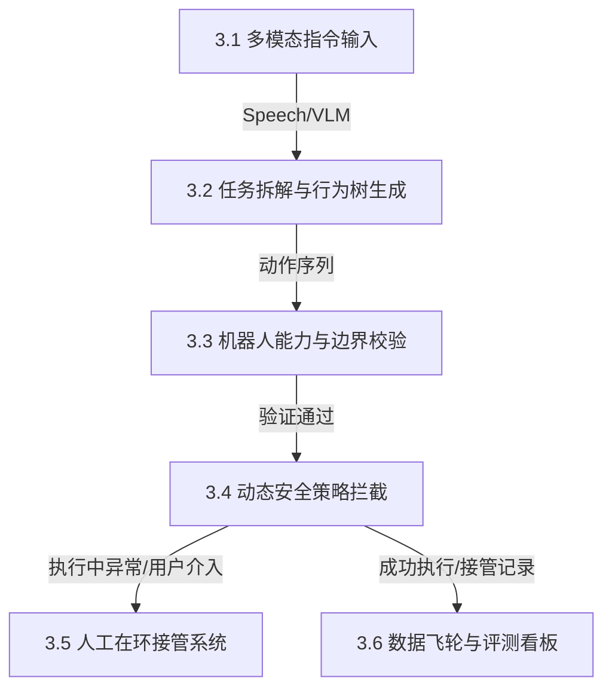

# 产品需求文档 (PRD)：具身智能任务规划与安全评估平台

- **文档编号**：PRD-001
- **文档状态**：草案 (Draft)
- **版本**：v1.0.0
- **创建时间**：2026-06-21
- **Owner**：具身智能产品组 (Embodied AI Product Team)

---

## 1. 业务背景与产品愿景 (Vision & Goals)

### 1.1 行业痛点
当前，基于大语言模型（LLM）和多模态大模型（VLM）的具身智能技术正在经历从实验室走向商用的关键阶段。然而，在真实物理世界（特别是家庭和仓储等非结构化环境）中落地时，面临以下痛点：
1. **语义鸿沟 (Semantic Gap)**：人类指令（如“收拾一下房间”）是高度模糊的，而机器人底层控制（运动规划、力控）需要精确的轨迹点和离散的动作序列（Action Tokens）。
2. **长尾与物理安全风险 (Safety & Long-Tail)**：纯端到端大模型容易产生“物理幻觉”（例如：将猫当成抹布、试图搬运超过自身负载的重物），导致设备损坏或人身伤害。
3. **数据黑盒与难以评估 (Black-box Evaluation)**：大模型做出的规划链路难以被监控和审计，缺乏有效的坏案（Bad Cases）人工接管及数据回流迭代（数据飞轮）闭环。

### 1.2 产品定位与愿景
**Embodied-TaskFlow** 是一款面向**双臂移动人形机器人（Humanoid Robot）**的**高层任务规划（High-level Task Planning）与安全评估平台**。通过构建“感知-规划-安全拦截-仿真反馈-数据回流”的产品闭环，降低机器人任务失败率，实现物理安全可控。

---

## 2. 目标用户与典型物理场景 (Personas & Scenarios)

### 2.1 目标受众
- **系统集成商/算法开发人员**：使用本系统定义并测试机器人的高层任务规划能力，并收集测试数据。
- **现场运营/家庭用户**：在机器人规划失败或触发安全警报时，通过 UI/语音进行人工纠偏与接管。

### 2.2 典型应用场景 (Typical Scenarios)

#### 场景 A：非结构化家庭环境下的“溢出物清理”
*   **输入指令**：“把桌上洒的牛奶清理干净，顺便把脏杯子放回水槽。”
*   **物理环境**：桌上有咖啡杯（内有残留液体）、倾倒的牛奶盒、抹布、以及一只随机走动的猫。
*   **规划逻辑**：
    1. 识别并分割牛奶渍（VLM 语义分割）。
    2. 规划动作：抓取抹布 -> 擦拭牛奶 -> 将抹布放入垃圾桶 -> 抓取脏杯子 -> 导航至厨房水槽 -> 放下杯子。
*   **安全拦截点**：擦拭时必须避开活体（猫）；若擦拭可能导致液体流向排插，触发策略拦截。

#### 场景 B：夜间陪伴与安全巡检
*   **输入指令**：“去厨房倒一杯温水，送到老奶奶房间。如果水温过高，等它凉一点再给。”
*   **安全拦截点**：机器人水温传感器检测到水温为 80°C。安全引擎拦截原规划，插入“等待降温”或“发出语音预警”状态。

---

## 3. 功能需求说明 (Functional Requirements)

### 3.1 多模态指令输入解析 (Multi-Modal Instruction Parsing)
- **需求描述**：系统必须支持文本、语音以及“图像+文本”的多模态输入。
- **业务规则**：
  - 支持视觉提示（Visual Grounding），如用户手指向某一物体并说“把**这个**扔掉”，系统需结合相机 RGB-D 帧对目标物体进行 3D 边界框（Bounding Box）定位。
  - 对于模糊指令（如“收拾桌子”），输入解析模块必须自动生成反问机制：“检测到桌上有书本、钥匙和水杯，请问需要全部收纳吗？”

### 3.2 任务拆解与行为树生成 (Task Decomposition & Behavior Tree Generation)
- **需求描述**：高层任务规划器将复杂指令拆解为**行为树（Behavior Tree, BT）**或有向无环图（DAG），并以 JSON 格式输出。
- **核心逻辑**：
  - 行为树节点必须包含：`Sequence`（顺序节点）、`Selector`（选择节点）、`Action`（执行叶子节点）、`Condition`（条件检测节点）。
  - 大模型规划输出的 Action 必须映射到机器人支持的底层原语库（Skill Library，如 `navigate_to`、`pick_object`、`place_object`、`pour_liquid`）。

### 3.3 机器人能力与物理边界校验 (Affordance & Kinematics Grounding)
- **需求描述**：系统在将任务下发给底层控制器前，必须根据机器人的物理规格进行 Affordance（物理可行性）校验。
- **校验内容**：
  - **负载极限**：若检测到目标物体重量超过单臂 5kg/双臂 10kg 的物理极限，则拦截规划并报错。
  - **几何触达度**：结合环境三维点云，校验机械臂工作空间（Workspace）是否可达目标物体。

### 3.4 动态安全策略拦截引擎 (Dynamic Safety Policy Engine)
- **需求描述**：独立于大模型的规则引擎（Policy Engine），作为系统底层的“脊髓反射”，拥有最高执行优先级。
- **安全规则定义**：
  
  | 规则编号 | 拦截规则条件 | 拦截触发动作 | 严重等级 |
  | :--- | :--- | :--- | :--- |
  | **SEC-001** | 检测到移动路径 0.5 米内存在活体（人/宠物） | 停止移动并报警，重新规划路径 | Critical |
  | **SEC-002** | 搬运液体温度 > 50°C 且有人类在场 | 速度限制在 0.2m/s 内，发出语音提示 | Major |
  | **SEC-003** | 传感器检测到碰撞力矩超过 15N·m | 开启关节力控软化，立即执行紧急制动 | Critical |

### 3.5 人工在环接管系统 (Human-in-the-Loop Override)
- **需求描述**：当机器人遇到无法规划的长尾场景（如目标物被遮挡）或安全引擎拦截时，提供无缝接管机制。
- **交互规范**：
  - **云端接管（Teleoperation）**：操作员可通过 Web 端 3D 视口，利用手柄或虚拟摇杆直接控制关节或下发笛卡尔坐标指令。
  - **语音纠偏**：在执行中，用户可随时喊出“停下”或“不对，拿左边那个杯子”，规划器应暂停当前任务，并利用新输入在当前位置增量更新规划树。

### 3.6 数据飞轮与评测看板 (Data Flywheel & Evaluation Dashboard)
- **需求描述**：面向产品运营和算法专家，提供任务运行指标分析与坏案回收机制。
- **核心功能**：
  - 记录每一次 Task Session，保存“指令 - 多模态感知帧 - 行为树 - 动作轨迹 - 传感器时序数据”。
  - 提供**一键标记坏案（Badcase Tagging）**功能。被接管或失败的 Session 自动打上标签并归档，导出为数据集用于算法团队重构 Prompt 或离线策略（Offline Policy）微调训练。

---

## 4. 非功能性需求与性能指标 (Non-Functional Requirements)

- **时延要求 (Latency)**：
  - 高层任务规划（LLM Request）生成延迟：$\le 2.0\text{ 秒}$。
  - 安全引擎物理拦截响应时间（端侧反射）：$\le 20\text{ 毫秒}$。
- **安全性标准 (Compliance)**：
  - 系统架构设计符合 ISO 13482（个人护理机器人安全标准）与 ISO 10218（工业机器人安全标准）。
- **健壮性与容错 (Robustness)**：
  - 云端网络中断时，端侧机器人必须能依靠端侧轻量化模型维持基础的安全避障并平稳刹车，禁止在断网时继续执行未完成的盲操动作。

---

## 5. 核心评测指标定义 (Evaluation Metrics)

产品上线及算法迭代效果需通过以下定量指标进行衡量：

1. **任务成功率 (Task Success Rate, TSR)**：
   $$\text{TSR} = \frac{\text{成功完成的指令数}}{\text{总下发指令数}} \times 100\%$$
2. **平均人工干预间隔时间 (Mean Time Between Overrides, MTBO)**：
   - 机器人能自主运行且无需人类介入的平均时长（以小时或任务数计）。
3. **路径执行效率比 (Path Efficiency Ratio, PER)**：
   $$\text{PER} = \frac{\text{理论最短路径长度}}{\text{机器人实际行走路径长度}}$$
   - 用于评估高层规划是否绕路、动作是否冗余。
4. **安全策略误拦截率 (False Positive Rate of Safety Rules)**：
   - 安全引擎因误判（如将阴影当成障碍物）而导致任务中断的比例。
