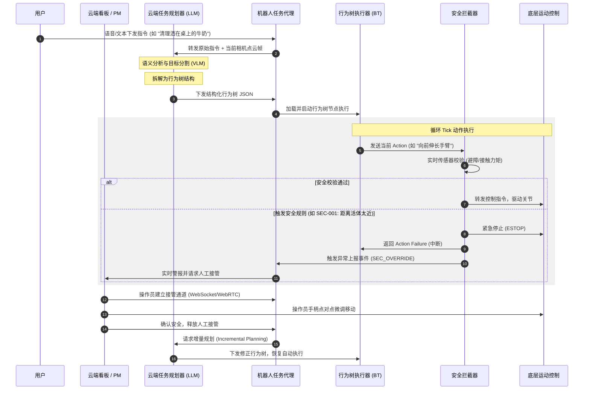

# 系统设计与接口规范 (SYS-001-architecture-spec)

| 文档审核人 | 系统架构评审委员会 |
| --- | --- |
| 重要性 | 高 |
| 紧迫性 | 高 |
| 需求方 | 算法集成商、端侧控制研发组、现场运营与数据分析组 |
| 文档编写人 | 系统架构组 (System Architecture Group) |
| 文档提交日期 | 2026-06-22 |

## 文档修改记录

| 变更时间 | 变更内容 | 变更提出部门与理由 | 修改人 | 审核人 | 版本号 |
| --- | --- | --- | --- | --- | --- |
| 2026-06-21 | 初始草案版本，定义端云协同架构与接口规范 | 初始立项，梳理架构分层与核心通信协议 | 系统架构组 | 评审委员会 | v1.0.0 |
| 2026-06-22 | 规范化文档头部格式，与 PRD-001 标准对齐，文档状态更新为已发布 | 统一文档规范，纳入项目文档体系 | Embodied AI PM | 评审委员会 | v1.1.0 |

---

## 1. 架构总览 (System Architecture Overview)

本系统采用端云协同分层架构。端侧（Robot Edge）侧重实时性、安全性与本地闭环控制；云侧（Cloud Services）侧重强算力支持的高层推理、长序列规划与大数据分析。

```txt
+-------------------------------------------------------------------+
|                           云端系统 (Cloud)                        |
|   +-----------------------+           +-----------------------+   |
|   | 任务规划器 (LLM)      |           | PM 评测与接管看板     |   |
|   | Task Planner Service  |           | Web Dashboard (HITL)  |   |
|   +-----------+-----------+           +-----------+-----------+   |
+---------------|-----------------------------------|---------------+
                | WebSocket                         | WebSocket/WebRTC
+---------------|-----------------------------------|---------------+
|               |           机器人端侧 (Edge)       |               |
|   +-----------v-----------+           +-----------v-----------+   |
|   | 任务接收代理          |           | 状态遥测与视频中继    |   |
|   | Task Agent (ROS 2)    |           | Telemetry Node        |   |
|   +-----------+-----------+           +-----------+-----------+   |
|               |                                   |               |
|               | ROS 2 (DDS)                       | ROS 2 (DDS)   |
|   +-----------v-----------+           +-----------v-----------+   |
|   | 行为树执行器          |<--------->| 实时安全拦截器        |   |
|   | BT Executor (ROS 2)   |           | Safety Interceptor    |   |
|   +-----------+-----------+           +-----------+-----------+   |
|               |                                   |               |
|               | ROS 2 Actions                     | 紧急停止 (ESTOP)|
|   +-----------v-----------+                       |               |
|   | 运动控制与物理执行    |<----------------------+               |
|   | Arm/Base Controllers  |                                       |
|   +-----------------------+                                       |
+-------------------------------------------------------------------+
```

### 1.1 端云模块职责划分

#### 云端 (Cloud)
- **任务规划器 (Task Planner Service)**：接收端侧或用户直接输入的任务请求，结合场景的 VLM 分割结果，通过大型语言模型（如 Claude 3.5）进行 CoT 任务拆解，生成结构化的 JSON 行为树。
- **PM 评测与接管看板 (Web Dashboard)**：展示当前所有机器人任务执行状态、时序遥测数据（关节扭矩、速度、温度等）。在触发安全拦截或遇到无法拆解的异常时，提供人工接管界面，中继手柄控制信号及 WebRTC 低延迟视频流。

#### 机器人端侧 (Edge)
- **任务接收代理 (Task Agent Node)**：基于 C++/Python 开发，作为云端与端侧 ROS 2 的桥梁，维护安全的 WebSocket 双向连接，接收云端分发的规划树，并向云端上报高频遥测状态。
- **行为树执行器 (BT Executor Node)**：解析 JSON 格式的行为树，调度并执行底层具体技能（Skills），管理行为树节点的 Tick 状态。
- **实时安全拦截器 (Safety Interceptor Node)**：本地高频运行（>= 100Hz）的策略防护罩。直接订阅激光雷达、深度相机点云、防碰撞触觉传感器及关节扭矩，一旦匹配安全规则，立即发出强行制动指令（ESTOP），拦截行为树的继续执行。
- **运动控制与物理执行 (Arm/Base Controllers)**：底盘移动（ROS 2 Navigation）与双臂伺服控制（MoveIt 2 / 关节阻抗控制）。

---

## 2. 核心数据流时序设计 (Data Sequence Diagram)

以下展示机器人接收指令、环境分割、任务规划、安全拦截到人工干预的典型时序流程：



---

## 3. 通信接口与协议规范 (API Interface Spec)

### 3.1 任务规划请求接口 (Task Planning Request)
- **协议**：HTTPS POST / WebSocket
- **云端接入点**：`/api/v1/planner/task`
- **请求负载定义 (Request Schema)**：

```json
{
  "$schema": "https://json-schema.org/draft/2020-12/schema",
  "title": "TaskPlanningRequest",
  "type": "object",
  "required": ["session_id", "robot_id", "instruction", "perception_context"],
  "properties": {
    "session_id": {
      "type": "string",
      "description": "唯一会话标识符，用于追踪单次长任务生命周期"
    },
    "robot_id": {
      "type": "string",
      "description": "目标执行机器人的硬件UUID"
    },
    "instruction": {
      "type": "string",
      "description": "人类用户下发的自然语言指令"
    },
    "perception_context": {
      "type": "object",
      "required": ["objects", "obstacle_grid_map"],
      "properties": {
        "objects": {
          "type": "array",
          "items": {
            "type": "object",
            "required": ["label", "confidence", "bbox_3d"],
            "properties": {
              "label": { "type": "string", "description": "物体语义标签，如 cup" },
              "confidence": { "type": "number", "minimum": 0.0, "maximum": 1.0 },
              "bbox_3d": {
                "type": "array",
                "minItems": 6,
                "maxItems": 6,
                "description": "[x_center, y_center, z_center, width, length, height]"
              }
            }
          }
        },
        "obstacle_grid_map": {
          "type": "string",
          "description": "经端侧压缩编码的局部2D代价地图或3D体素网格"
        }
      }
    }
  }
}
```

### 3.2 任务规划响应与行为树格式 (Task Planning Response / Behavior Tree Format)
规划响应返回符合行为树结构的执行网络。
- **协议格式**：JSON
- **响应负载定义 (Response Schema)**：

```json
{
  "$schema": "https://json-schema.org/draft/2020-12/schema",
  "title": "TaskPlanningResponse",
  "type": "object",
  "required": ["session_id", "status", "root_node"],
  "properties": {
    "session_id": { "type": "string" },
    "status": {
      "type": "string",
      "enum": ["SUCCESS", "FAILED_INVALID_INSTRUCTION", "FAILED_UNREACHABLE_GOAL"]
    },
    "root_node": {
      "type": "object",
      "required": ["node_id", "type", "label"],
      "properties": {
        "node_id": { "type": "string", "description": "节点唯一标识" },
        "type": {
          "type": "string",
          "enum": ["Sequence", "Selector", "ActionNode", "ConditionNode"]
        },
        "label": { "type": "string", "description": "节点功能描述" },
        "parameters": {
          "type": "object",
          "description": "针对 Action 节点定义的控制原语参数"
        },
        "children": {
          "type": "array",
          "items": { "$ref": "#" }
        }
      }
    }
  }
}
```

#### 行为树输出样例 (Example Payload)
当输入为“把脏杯子放回水槽”时，规划器返回的响应数据范例：

```json
{
  "session_id": "sess_987654321_abc",
  "status": "SUCCESS",
  "root_node": {
    "node_id": "root_0",
    "type": "Sequence",
    "label": "收纳杯子主流程",
    "children": [
      {
        "node_id": "cond_find_cup",
        "type": "ConditionNode",
        "label": "确认脏杯子在视野中",
        "parameters": { "target_object": "dirty_cup" }
      },
      {
        "node_id": "seq_pick_place",
        "type": "Sequence",
        "label": "抓取并放置序列",
        "children": [
          {
            "node_id": "act_pick",
            "type": "ActionNode",
            "label": "抓取杯子",
            "parameters": {
              "target": "dirty_cup",
              "force_limit": 5.0,
              "grasp_type": "top_down"
            }
          },
          {
            "node_id": "act_nav_kitchen",
            "type": "ActionNode",
            "label": "导航至厨房",
            "parameters": {
              "goal_pose": [4.5, -2.1, 0.0]
            }
          },
          {
            "node_id": "act_place_sink",
            "type": "ActionNode",
            "label": "将杯子轻放到水槽内",
            "parameters": {
              "target_surface": "kitchen_sink",
              "place_pose": [4.8, -2.3, 0.8]
            }
          }
        ]
      }
    ]
  }
}
```

### 3.3 遥测与异常上报数据格式 (Telemetry & Safety Event Schema)
端侧高频向云端看板同步心跳与关键指标，便于 PM 评测模块做自动化记录与故障分析。
- **协议**：WebSocket Bidirectional Stream
- **数据负载定义 (Telemetry Schema)**：

```json
{
  "$schema": "https://json-schema.org/draft/2020-12/schema",
  "title": "RobotTelemetry",
  "type": "object",
  "required": ["timestamp", "robot_id", "system_status", "telemetry_metrics"],
  "properties": {
    "timestamp": { "type": "integer", "description": "毫秒级Unix时间戳" },
    "robot_id": { "type": "string" },
    "system_status": {
      "type": "string",
      "enum": ["IDLE", "EXECUTING", "ESTOP_TRIGGERED", "TELEOP_OVERRIDE"]
    },
    "current_active_node": {
      "type": "string",
      "description": "当前正在执行的行为树 node_id"
    },
    "telemetry_metrics": {
      "type": "object",
      "required": ["battery_level", "collision_force", "joint_temperatures"],
      "properties": {
        "battery_level": { "type": "number", "minimum": 0.0, "maximum": 1.0 },
        "collision_force": { "type": "number", "description": "单位 N·m" },
        "joint_temperatures": {
          "type": "array",
          "items": { "type": "number" },
          "description": "机器人各关节电机实时温度 (摄氏度)"
        }
      }
    },
    "safety_event": {
      "type": "object",
      "properties": {
        "event_code": { "type": "string", "description": "如 SEC-001, SEC-003" },
        "description": { "type": "string" },
        "triggered_raw_data": { "type": "string", "description": "触发安全策略时的传感器快照" }
      }
    }
  }
}
```
