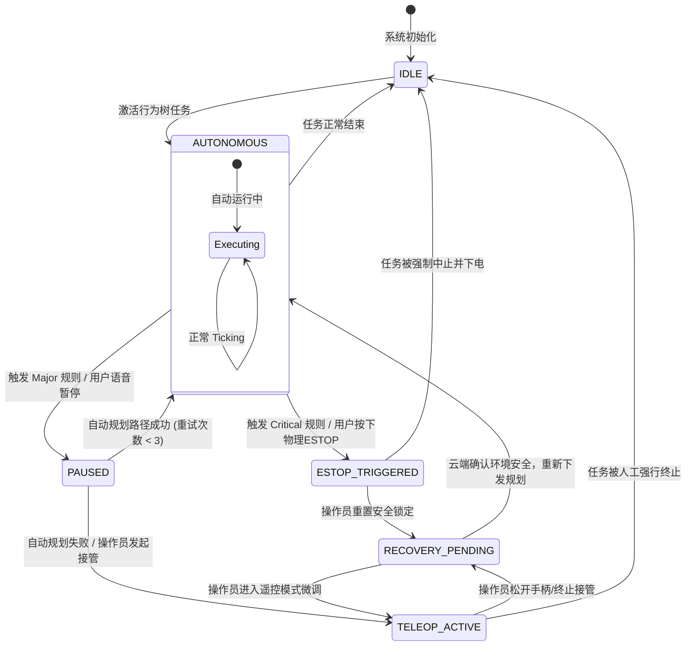

# 安全规则策略与数据飞轮规范 (SYS-002-safety-rules-and-data-flywheel)

- **文档编号**：SYS-002
- **文档状态**：草案 (Draft)
- **版本**：v1.0.0
- **创建时间**：2026-06-21
- **Owner**：系统安全与数据策略组 (Safety & Data Strategy Group)

---

## 1. 多级安全反射规则库 (Safety Reflex Rules Library)

物理安全是具身智能的核心壁垒。端侧安全拦截器（Safety Interceptor）直接读取传感器时序数据，采用硬编码判定规则，其优先级高于行为树与大模型规划。

### 1.1 规则分级定义
- **Critical (致命级)**：直接威胁人身安全、机器人本体结构安全或关键执行机构。触发后执行紧急软刹车（ESTOP），切断电机供电（或进入阻抗软化模式），且必须人工确认后方可释放。
- **Major (严重级)**：任务无法继续执行、路径严重受阻或可能导致轻微碰撞。触发后暂停当前行为树节点，机器人在原地安全姿态等待，允许规划器自动尝试重规划最多 3 次。
- **Minor (轻微级)**：非致命性的物理偏差，例如目标物体发生微小位移或光照变化导致感知置信度降低。触发后在线修正参数（如调整夹爪力度、重新对准物体），不中断任务。

### 1.2 核心安全规则阈值定义

| 规则编号 | 级别 | 监控输入数据 | 触发阈值条件 | 拦截执行动作 | 恢复机制 |
| :--- | :--- | :--- | :--- | :--- | :--- |
| **SEC-001** | Critical | 激光雷达/深度相机点云 | 机器人运动半径 0.3m 内存在活体（人/宠物） | 停止移动，切断双臂动力，语音警报 | 强制人工释放 |
| **SEC-002** | Major | 机器人手腕端力敏传感器 | 接触力矩 > 10 N·m 且持续时间 > 50ms | 停止当前轨迹执行，双臂回缩至防碰撞姿态 | 规划器自动重规划路线 |
| **SEC-003** | Critical | 电机驱控板时序电流 | 单个关节电机电流 > 额定电流 150% 达 20ms | 触发硬 ESTOP，电机离线，防止烧毁电机 | 强制工程维护接管 |
| **SEC-004** | Major | 红外热成像相机 / VLM | 目标液体/物体温度 > 60°C 且存在徒手接触 | 拦截抓取动作，发出高温语音警告 | 人工接管或等待降温 |
| **SEC-005** | Minor | 夹爪内侧滑移传感器 | 物体产生滑移位移 > 5mm/s 且重量未达极限 | 夹爪抓力阶梯式增加 2N，最大不超过 25N | 自动在线修正 |

---

## 2. 人机在环接管状态机 (HITL State Machine Design)

人工在环（Human-in-the-Loop, HITL）状态机负责管理自动控制权与人工控制权之间的无缝交接，保证接管过程中的物理平稳性（无突变力矩）。



### 2.1 状态转换动作与安全保障机制
1. **阻抗软化过渡 (Impedance Softening)**：当从 `AUTONOMOUS` 转换为 `ESTOP_TRIGGERED` 时，控制器不应瞬间关断所有电流（这会导致双臂因重力砸落损坏），而应切换至重力补偿与刚度极低的关节阻抗控制模式，使双臂自然顺从物理碰撞外力。
2. **控制权平滑切换 (Smooth Control Transfer)**：从 `TELEOP_ACTIVE` 切换回 `AUTONOMOUS` 时，系统必须对云端新规划的轨迹起点与机器人当前物理关节角进行插值对齐，限制加速度跳变，避免突跳抖动。

---

## 3. 数据飞轮与坏案标注规范 (Data Flywheel Specification)

数据飞轮的核心在于“将线上失败的 Session 转化为高质量的微调数据集”。这需要结构化的标注定义，将多模态传感器时序与人类接管意图相结合。

### 3.1 坏案归档日志数据结构 (Bad Case Log Session Schema)
每次任务失败或发生接管时，端侧 Task Agent 会将该 Session 的历史时序打包并生成 JSON 格式归档。

```json
{
  "session_id": "sess_20260621_001",
  "meta_data": {
    "robot_uuid": "r-00987-humanoid",
    "operator_id": "op-admin-12",
    "timestamp_start": 1782035400000,
    "timestamp_end": 1782035445000
  },
  "raw_instruction": "帮我把桌子上的热咖啡递过来",
  "execution_result": "FAILED_BY_SAFETY_INTERCEPT",
  "failure_reason": {
    "event_code": "SEC-004",
    "description": "检测到目标物热咖啡温度达 68 摄氏度，超过徒手接触安全限值"
  },
  "trajectory_history": [
    {
      "step_time": 1782035412000,
      "active_node_id": "act_nav_table",
      "perception_snapshot": {
        "rgb_image_url": "http://oss/teleop/sess_001/frame_12.jpg",
        "detected_objects": [
          { "label": "cup", "bbox_3d": [1.2, 0.4, 0.9, 0.1, 0.1, 0.15] }
        ]
      },
      "robot_states": {
        "base_pose": [1.15, 0.38, 0.05],
        "joint_positions": [0.0, -0.2, 0.1, 1.5, 0.0, 0.0, 0.0],
        "joint_torques": [0.12, 1.25, 0.88, 4.22, 0.01, 0.0, 0.0]
      },
      "action_output": {
        "velocity_command": [0.1, 0.0, 0.05],
        "arm_joint_target": [0.0, -0.2, 0.1, 1.5, 0.0, 0.0, 0.0]
      }
    }
  ]
}
```

### 3.2 多模态 JSONL 数据集标注格式 (Multimodal Dataset Export Format)
产品经理可以通过看板筛选出所有标记为“由于 LLM 规划路径错误触发接管”的 Session，导出为如下用于监督微调（SFT）或离线强化学习的数据集格式。

导出格式为标准 JSON Lines (每行为一个完整的 JSON 对象，方便数据清洗框架直接读取)：

```json
{"session_id": "sess_20260621_001", "instruction": "帮我把桌子上的热咖啡递过来", "conversations": [{"from": "human", "value": "根据传感器读数，咖啡温度为 68 摄氏度，请重新制定安全搬运路线。"}, {"from": "gpt", "value": "检测到目标物体温度过高（68°C）。执行安全规避动作：Sequence: [1. 语音播报: \"咖啡温度较高，正在为您使用隔热垫\"；2. 导航至收纳柜抓取隔热垫；3. 使用隔热垫抓取杯子；4. 递送至目标位置]。"}]}
{"session_id": "sess_20260621_002", "instruction": "清理桌子上的液体", "conversations": [{"from": "human", "value": "液体流向了电源排插，该如何处理？"}, {"from": "gpt", "value": "检测到漏电隐患。执行紧急动作：Sequence: [1. 拦截当前擦拭动作；2. 动作回撤 0.5 米；3. 开启声光报警并发送远程接管请求；4. 等待人类关闭排插电源后重新规划擦拭路线]。"}]}
```
